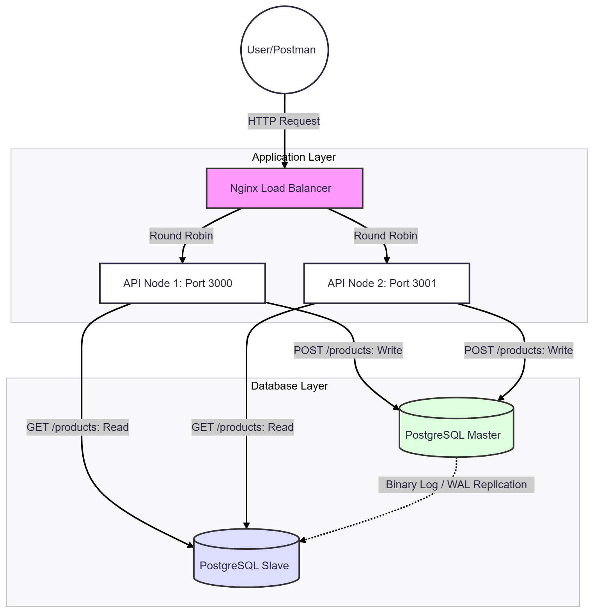

**ĐẠI HỌC QUỐC GIA THÀNH PHỐ HỒ CHÍ MINH**

**TRƯỜNG ĐẠI HỌC KHOA HỌC TỰ NHIÊN**

**Khoa Công nghệ Thông tin**

**MÔN:** Thiết kế phần mềm

**Scalable System Design**

**GIẢNG VIÊN:** 

	Phạm Minh Tuấn 

	Ngô Ngọc Đăng Khoa 

	Trương Phước Lộc 

**LỚP:** 23KTPM3

**SINH VIÊN:**

	Trương Hoàng Lâm – 23127402 – thlam23@clc.fitus.edu.vn

TP. HCM, 1 tháng 5, 2026

## I. **System Architecture Diagram** 


---

## II. **Configuration Snippets** 

### 1. **Load balancer (Nginx)**

Load Balancer đóng vai trò là một Reverse Proxy, đóng vai trò là cổng tiếp nhận duy nhất (Single Entry Point) cho mọi yêu cầu từ phía Client. Hệ thống sử dụng thuật toán Round Robin (mặc định của Nginx) để điều phối và phân tán lưu lượng truy cập đồng đều đến các API Node phía sau.

**File:** `nginx/nginx.conf`
```nginx
upstream api_servers {
    server server-api-1:3000;
    server server-api-2:3000;
}

server {
    listen 80;

    location / {
        proxy_pass http://api_servers;
        proxy_set_header Host $host;
        proxy_set_header X-Real-IP $remote_addr;
        proxy_set_header X-Forwarded-For $proxy_add_x_forwarded_for;
        proxy_set_header X-Forwarded-Proto $scheme;
    }
}
```
*   **`upstream api_servers`**: Đây là nơi định nghĩa nhóm các server API chạy phía sau.
*   **`proxy_pass`**: Dùng để chuyển tiếp yêu cầu nhận được (từ client) đến nhóm server API đã định nghĩa trong `upstream api_servers`.
*   **`proxy_set_header`**: Các dòng này dùng để "đính kèm" thêm thông tin vào header của request trước khi gửi đến API server. Nhờ đó, API server biết được thông tin gốc của client (như địa chỉ IP thật qua `X-Real-IP`, hoặc biết yêu cầu ban đầu là HTTPS qua `X-Forwarded-Proto`) chứ không chỉ thấy thông tin của Nginx.
---

### 2. **Database (PostgreSQL Master-Slave Replication)**

Hệ thống sử dụng **Streaming Replication**, nơi database Master liên tục gửi các bản ghi Write-Ahead Log (WAL) của nó đến database Slave để giữ cho chúng luôn đồng bộ.

**Cấu hình Master**
**File:** `postgres/master/postgres.conf`
```conf
wal_level = replica
max_wal_senders = 10
max_replication_slots = 10
hot_standby = on
wal_keep_size = 128MB
```
*   **`wal_level = replica`**: Yêu cầu PostgreSQL ghi đủ thông tin vào WAL để hỗ trợ lưu trữ và sao chép.
*   **`max_wal_senders`**: Số lượng kết nối tối đa từ các server standby hoặc client sao lưu streaming.
*   **`hot_standby = on`**: Cho phép server standby (Slave) chấp nhận kết nối và chạy các truy vấn read-only trong khi sao chép.

**Câu hình pg_hba.conf**
**File:** `postgres/master/pg_hba.conf`
```conf
# TYPE  DATABASE       USER            ADDRESS                 METHOD
local   all             all                                     trust
host    all             all             0.0.0.0/0               md5
host    all             all             ::/0                    md5

host    replication    replicator      0.0.0.0/0               md5
host    replication    replicator      ::/0                    md5
```
*   **`TYPE = host`**: Cho phép kết nối qua mạng.
*   **`DATABASE = replication`**: Chỉ áp dụng cho các kết nối replication.
*   **`USER = all`**: Áp dụng cho mọi user.
*   **`ADDRESS = [IP_ADDRESS]`**: Chỉ cho phép kết nối từ mọi địa chỉ IP.
*   **`METHOD = md5`**: Yêu cầu xác thực bằng mật khẩu sử dụng phương thức md5.

**Cấu hình Slave**
**File:** `postgres/slave/postgres.conf`
```conf
hot_standby = on
hot_standby_feedback = on
```
*   **`hot_standby = on`**: Cho phép server standby (Slave) chấp nhận kết nối và chạy các truy vấn read-only trong khi sao chép.
*   **`hot_standby_feedback = on`**: Ngăn Master xóa các bản ghi WAL mà Slave vẫn còn cần cho các truy vấn read-only dài hạn, giảm xung đột "hủy truy vấn".

---

### 3. **Application Layer (Read/Write Splitting)**

Để tối ưu hiệu suất, API được thiết kế để điều hướng các thao tác Ghi (Write) đến Master và phân chia các thao tác Đọc (Read) cho Slave.

**File:** `server/src/db/db.js`
```javascript
const masterDB = knex({
    client: "pg",
    connection: {
        host: process.env.MASTER_DB_HOST, // Trỏ đến 'postgresql-master'
        port: process.env.DB_PORT,
        user: process.env.DB_USER,
        password: process.env.DB_PASSWORD,
        database: process.env.DB_DATABASE
    }
});

const slaveDB = knex({
    client: "pg",
    connection: {
        host: process.env.SLAVE_DB_HOST, // Trỏ đến 'postgresql-slave'
        port: process.env.DB_PORT,
        user: process.env.DB_USER,
        password: process.env.DB_PASSWORD,
        database: process.env.DB_DATABASE
    }
});
```
*   **`masterDB` instance**: Được sử dụng cho các truy vấn `INSERT`, `UPDATE`, và `DELETE`. Nó kết nối trực tiếp đến node Master.
*   **`slaveDB` instance**: Được sử dụng cho các truy vấn `SELECT`. Điều này giúp giảm tải lưu lượng đọc từ Master, cho phép hệ thống mở rộng khi số lượng yêu cầu đọc tăng lên.

## III. **Setup Guide** 

### Bước 1: Chuẩn bị môi trường
Đảm bảo máy tính đã cài đặt:
- **Docker** & **Docker Compose**.
- **Postman** hoặc **cURL** để kiểm tra API.

### Bước 2: Cấu trúc thư mục dự án
```text
project-root/
│── docker-compose.yml
│── db.sql
│── nginx/
│   └── nginx.conf
│── postgres/
│   ├── master/
│   │   ├── postgres.conf
│   │   └── pg_hba.conf
│   └── slave/
│       └── postgres.conf
└── server/
    ├── src/
    │   ├── db/
    │   │   └── db.js
    │   └── index.js
    ├── .env
    ├── package.json
    └── dockerfile
```

### Bước 3: Cấu hình lớp Dữ liệu (PostgreSQL Replication)
Hệ thống sử dụng Docker image `bitnami/postgresql` để thiết lập cơ chế **Streaming Replication**. Đây là trái tim của khả năng mở rộng dữ liệu.
1.  **Cấu hình Master (`postgres/master/postgres.conf`)**
    Thiết lập các thông số về WAL (Write-Ahead Log) và quyền truy cập.
    ```conf
    listen_addresses = '*'
    wal_level = replica
    max_wal_senders = 10
    max_replication_slots = 10
    hot_standby = on
    wal_keep_size = 128MB
    ```
    `wal_level = replica` đảm bảo Master ghi đủ nhật ký thay đổi để Slave có thể "bắt chước" theo.

    `wal_keep_size` giữ lại một lượng nhật ký dự phòng, giúp Slave có thể hồi phục nếu bị mất kết nối tạm thời mà không cần đồng bộ lại từ đầu.

2.  **Cấu hình xác thực (`postgres/master/pg_hba.conf`)**
    Khai báo quyền cho User replication.
    ```conf
    host replication replicator 0.0.0.0/0 md5
    host all all 0.0.0.0/0 md5
    ```
    PostgreSQL phân tách luồng dữ liệu thông thường và luồng replication. Chúng ta cần cấp quyền riêng cho user `replicator` để nó có thể "kéo" (stream) nhật ký WAL từ Master về Slave.
3.  **Cấu hình Slave (`postgres/slave/postgres.conf`)**
    Kích hoạt chế độ Standby.
    ```conf
    hot_standby = on
    hot_standby_feedback = on
    ```
    `hot_standby = on` cho phép chúng ta thực hiện các câu lệnh `SELECT` trên Slave ngay cả khi nó đang trong quá trình đồng bộ, giúp giảm tải cho Master.
4.  **Khởi tạo Schema (`db.sql`)**
    Định nghĩa bảng dữ liệu ban đầu.
    ```sql
    CREATE TABLE IF NOT EXISTS products (
        id SERIAL PRIMARY KEY,
        name VARCHAR(255) NOT NULL,
        price DECIMAL(10, 2) NOT NULL,
        created_at TIMESTAMP DEFAULT CURRENT_TIMESTAMP
    );
    ```
    File này được mount vào container Master để tự động tạo cấu trúc bảng khi hệ thống khởi chạy lần đầu. Dữ liệu này sau đó sẽ tự động được đồng bộ sang Slave qua cơ chế replication.
---
### Bước 4: Phát triển API Server (Node.js)
Lớp ứng dụng đóng vai trò điều hướng thông minh giữa Master và Slave.
1.  **Cấu trúc Logic (`server/src/db/db.js`)**
    Khởi tạo 2 instance kết nối riêng biệt: `masterDB` (Write) và `slaveDB` (Read).
    Việc tách biệt kết nối ngay từ lớp mã nguồn (App Level) giúp chúng ta kiểm soát tuyệt đối luồng dữ liệu. Các thao tác ghi nặng nề sẽ không làm ảnh hưởng đến tốc độ truy vấn đọc của người dùng.
2.  **Quản lý biến môi trường (`server/.env`)**
    Khai báo các thông số kết nối linh hoạt.
    ```env
    DB_USER=postgres
    DB_PASSWORD=123456
    DB_DATABASE=scalable_system_db
    MASTER_DB_HOST=postgresql-master
    SLAVE_DB_HOST=postgresql-slave
    DB_PORT=5432
    ```
    Sử dụng biến môi trường giúp mã nguồn độc lập với hạ tầng. Khi triển khai trên Docker, các Hostname sẽ tự động được phân giải thông qua tên Service trong mạng nội bộ.
---
### Bước 5: Cấu hình Điều phối tải (Nginx Load Balancer)
Nginx đóng vai trò là "Single Entry Point" (Cổng tiếp nhận duy nhất), giúp che giấu cấu trúc mạng nội bộ và phân phối tải.
* : Tạo file `nginx/nginx.conf` để định nghĩa nhóm server và quy tắc chuyển tiếp.
    ```nginx
    upstream api_servers {
        server server-api-1:3000;
        server server-api-2:3000;
    }
    server {
        listen 80;
        location / {
            proxy_pass http://api_servers;
            proxy_set_header Host $host;
            proxy_set_header X-Real-IP $remote_addr;
        }
    }
    ```

    *   **Upstream & Round Robin**: Giúp hệ thống có khả năng mở rộng ngang (Horizontal Scaling). Khi lượng người dùng tăng, ta chỉ cần thêm server vào cụm `upstream` mà không cần thay đổi IP của khách hàng.
    *   **Proxy Headers**: Giúp API server nhận diện được IP thực của người dùng cuối thay vì IP nội bộ của Nginx, rất quan trọng cho việc bảo mật và ghi log.
---
### Bước 6: Tự động hóa với Docker Compose
Docker Compose là công cụ giúp chúng ta khởi chạy toàn bộ hạ tầng (5 containers) chỉ với một câu lệnh duy nhất, đảm bảo tính nhất quán giữa các môi trường.
* : Hoàn thiện file `docker-compose.yml` tại thư mục gốc để kết nối API và Load Balancer.
    ```yaml
    services:
      # API Node A
      server-api-1:
        build: ./server
        container_name: server-api-1
        environment:
          - NODE_NAME=API_SERVER_A
        env_file: ./server/.env
        depends_on:
          postgresql-master: { condition: service_healthy }
      # API Node B (Sử dụng cùng source code nhưng khác tên node để test)
      server-api-2:
        build: ./server
        container_name: server-api-2
        environment:
          - NODE_NAME=API_SERVER_B
        env_file: ./server/.env
        depends_on:
          postgresql-master: { condition: service_healthy }
      # Load Balancer
      nginx-lb:
        image: nginx:latest
        container_name: nginx-load-balancer
        ports:
          - "80:80"
        volumes:
          - ./nginx/nginx.conf:/etc/nginx/conf.d/default.conf:ro
        depends_on:
          - server-api-1
          - server-api-2
    ```

    *   **Isolation & Networking**: Docker tự động tạo ra một mạng nội bộ. Các service gọi nhau bằng tên (ví dụ: `http://server-api-1:3000`) giúp tránh việc phải cấu hình IP tĩnh phức tạp.
    *   **Dependency Management (`depends_on`)**: Chúng ta sử dụng `service_healthy` để đảm bảo API chỉ chạy khi Database Master đã sẵn sàng nhận kết nối, tránh lỗi crash app khi khởi động.
    *   **Environment Injection**: Việc truyền `NODE_NAME` khác nhau cho cùng một mã nguồn giúp chúng ta kiểm chứng được cơ chế Round Robin của Nginx ở bước kiểm thử.
---
### Bước 7: Khởi chạy và Kiểm tra (Verification)

Xác nhận hệ thống hoạt động đúng như thiết kế.

**Khởi chạy hệ thống:**

```bash
docker compose --env-file ./server/.env up -d
```

> **Kết quả mong đợi:** Slave phải nhận được bản tin đồng bộ từ Master ngay lập tức. Điều này chứng minh dữ liệu luôn được an toàn và nhất quán.

**Kiểm tra Load Balancing:**

1. Gửi liên tiếp 5-10 yêu cầu GET đến hệ thống.
2. Kiểm tra giá trị `processed_by` trong kết quả trả về.

> **Kết quả mong đợi:** Giá trị `processed_by` phải thay đổi luân phiên giữa `API_SERVER_A` và `API_SERVER_B` (Round Robin).

---
### Bước 8: Kiểm tra khả năng chịu lỗi (Chaos Test)
Mục tiêu cuối cùng của một hệ thống có khả năng mở rộng là tính sẵn sàng cao (High Availability).
    Dừng cưỡng ép một container API: `docker stop server-api-1`. Sau đó tiếp tục gửi yêu cầu từ Client.
     Một hệ thống tốt phải có khả năng tự phục hồi hoặc duy trì dịch vụ ngay cả khi một phần hạ tầng gặp sự cố. 
*   **Kết quả**: Nginx sẽ tự động nhận biết `server-api-1` không còn khả dụng và chuyển toàn bộ traffic sang `server-api-2`. Người dùng cuối sẽ không cảm nhận được sự gián đoạn dịch vụ.

## References
https://www.mydbops.com/blog/postgresql-replication#streaming-replication
https://gist.github.com/JosimarCamargo/40f8636563c6e9ececf603e94c3affa7